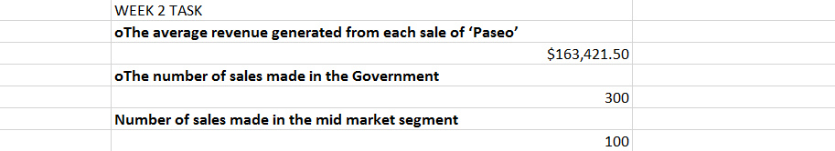
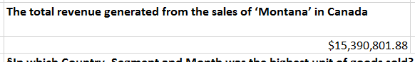
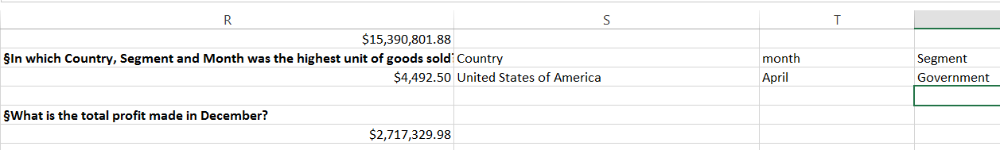

# Analysing-Sales-Data-for-Company-X
 Analysing-Sales-Data-for-Company-X

## This dataset was given to us by our instructor and we were required to calculate the
### The average revenue generated from each sale of ‘Paseo’
In calculating the average revenue generated from each sale of Paseo by Company X, the Averageif function was used. It was observed that, Paseo generated an average revenue of $163,421.50 thereby contributing massively to the average revenue generated by each product of the the Company. Marketting strategied should be implemented in the sales of other pfroducts.

### The number of sales made in the Government and Midmarket segment
This data was calculated using the Countif function and were calculated separately. The number of sales made in the government is 300 while that made at the mid market segment is 100 giving us a total of 400 sales made by government and mid market segments out 700 contributing 57% to the total sales by segment. This goes further to show that, more than half of the company sales came from these two segments.

### "The total revenue generated from the sales of ‘Montana’ in Canada

Used the Sumif function. It is worthy of note that the sales of Montana in Canada generated a revenue of $15,390,801.88 contributing 13% of the total revenue generated by the company.   

### In which Country, Segment and Month was the highest unit of goods sold?

Used the max function to calculate the highest units of good sold while Vlookup was used for the to determine the segment and month. Our findings show that, the amount of the highest unit of goods sold is $4,492.50 in the month of April by Gvernment in the United States of America.

### §What is the total profit made in December?
Total profit made in December is $2,717,329.98 and the Sumif function was used.
